# Assignment 7 — Secure Network Application Development Using TCP

## Objective
Enhance the GUI-based multi-client TCP chat application from Assignment 6 by adding practical security features such as authentication, password hashing, duplicate login prevention, input validation, failed login blocking, session timeout, and secure logging.

## Features Implemented
- Username and password based authentication
- Password storage using SHA-256 hashes in `users.json`
- Duplicate login prevention for the same user
- Input validation for usernames, passwords, messages, and commands
- Temporary login blocking after 5 failed attempts
- Logout support
- Inactivity-based session timeout
- Secure logging without storing plaintext passwords
- Private messaging and broadcast messaging
- Online user list refresh

## Project Files
- `server.py` — TCP server with authentication and security controls
- `client_gui.py` — Tkinter-based client GUI
- `users.json` — stored user credentials as SHA-256 hashes
- `chat_history.csv` — message history log
- `security_log.txt` — security events log
- `screenshots/` — screenshots used for report and Wireshark verification
- `report.pdf` — final report
- `handwritten_reflection.pdf` — scanned handwritten answers

## How to Run

### 1) Start Mininet
```bash
sudo /usr/local/bin/mn --topo single,5
```

Verify the topology:
```bash
nodes
net
pingall
```

### 2) Start the server
```bash
python3 server.py
```

### 3) Start the client
```bash
python3 client_gui.py
```

### 4) Login
Use a valid username and password that exist in `users.json`.

## Security Demonstration / Testing

### Login validation
The client/server should reject:
- empty passwords
- passwords shorter than 6 characters
- invalid usernames
- unknown users

### Failed login protection
After 5 failed attempts, the account is blocked for 60 seconds.

### Duplicate login prevention
If the same username is already logged in, the second login attempt is rejected.

### Session management
If the user stays inactive for too long, the server closes the session and logs a timeout event.

### Secure logging
The server records events such as:
- `LOGIN SUCCESS`
- `LOGIN BLOCKED`
- `DUPLICATE LOGIN BLOCKED`
- `SESSION TIMEOUT`
- `DISCONNECTED`
- `LOGOUT`

## Wireshark Verification
Capture packets on the TCP port used by the application:
```bash
tcp.port == 5000
```

Use Wireshark to show:
- login attempt
- failed login
- authenticated communication after login
- logout / disconnect traffic

## Screenshots
The screenshots below show the security checks, successful login flow, duplicate login prevention, session timeout, and Wireshark verification.

### Summary Sheet


### Authentication and validation
| Wrong password | User not found | Password too short |
|---|---|---|
| 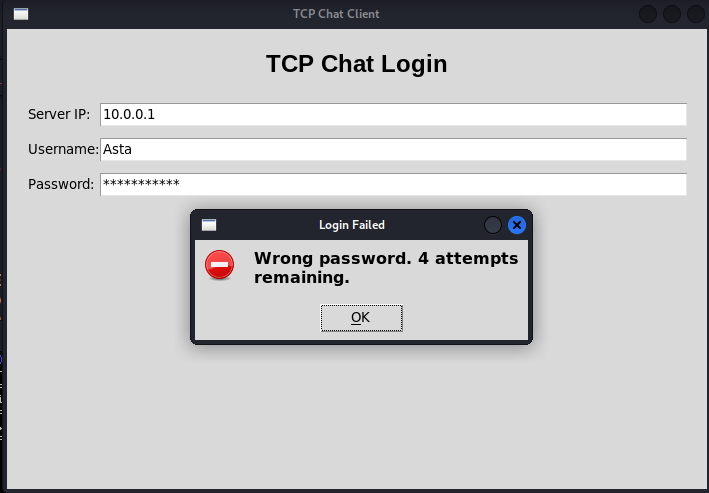 | 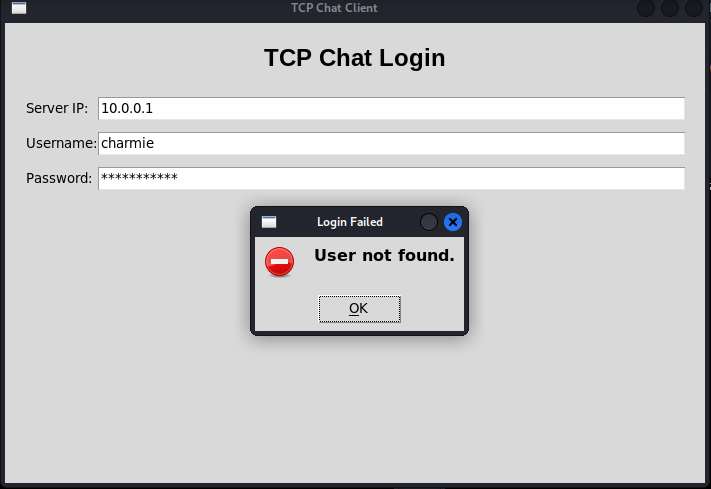 | 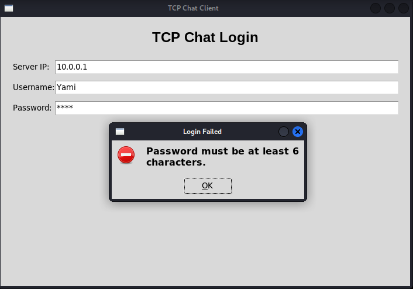 |

| Too many failed attempts | Successful login | Duplicate login blocked |
|---|---|---|
| 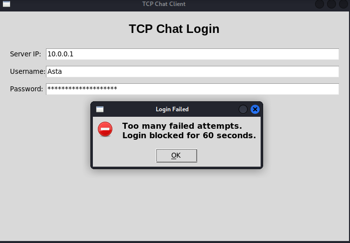 | 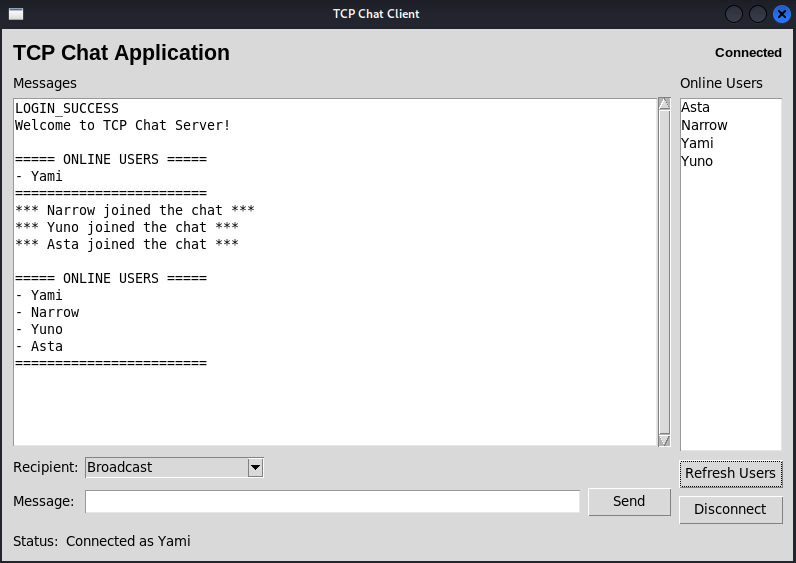 | 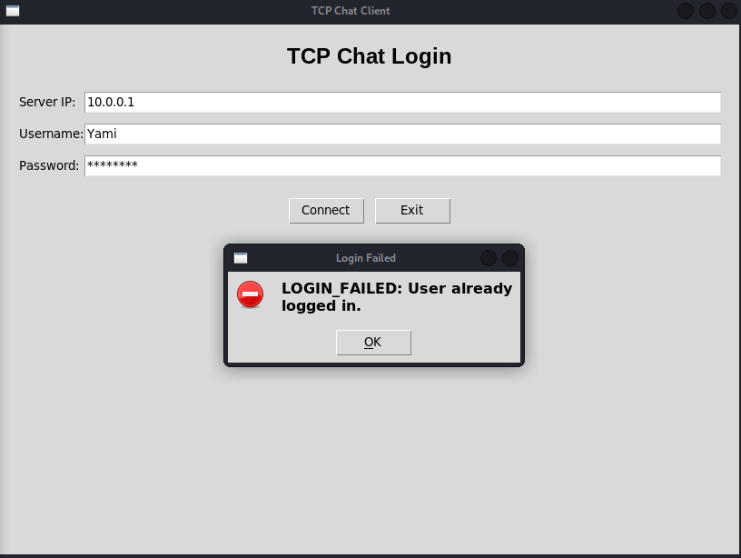 |

### Session and messaging
| Authenticated chat | Session timeout / disconnect | Server disconnect |
|---|---|---|
| 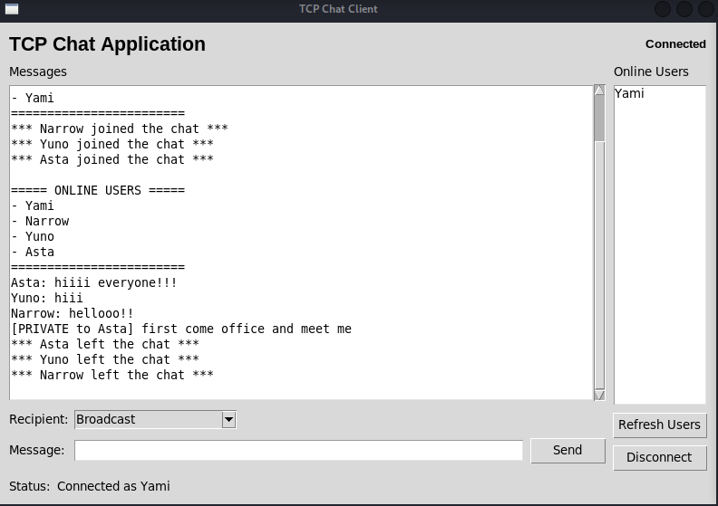 | 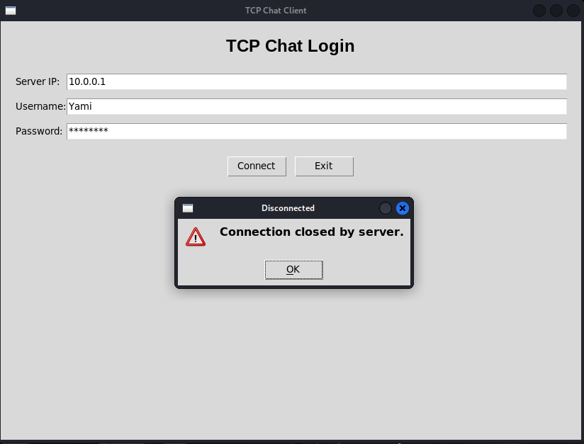 | 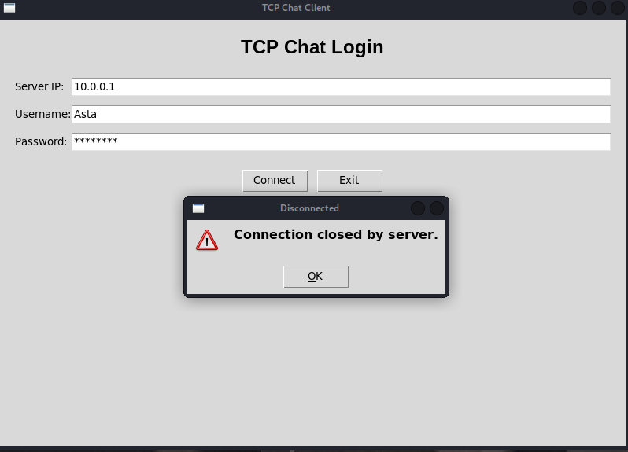 |

### Wireshark verification
| Failed login traffic | Authenticated traffic | Logout / timeout traffic |
|---|---|---|
| 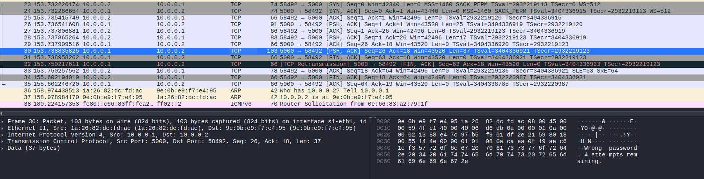 | 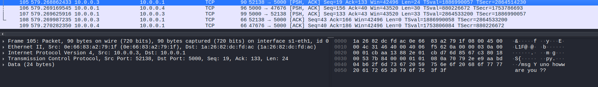 | 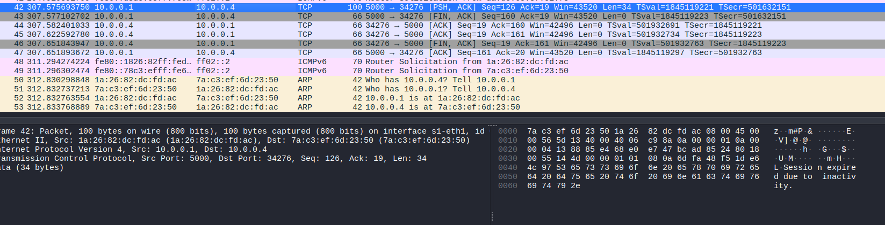 |

## Sample Test Data
Preloaded users are stored in `users.json` and are saved as SHA-256 hashes.

## Notes
- This project reuses the Assignment 6 TCP chat application and extends it with security features.
- Never store or display plaintext passwords.

## Conclusion
This assignment demonstrates how a simple GUI-based TCP chat system can be improved with basic security controls such as authentication, password hashing, duplicate login prevention, session management, and secure logging.
