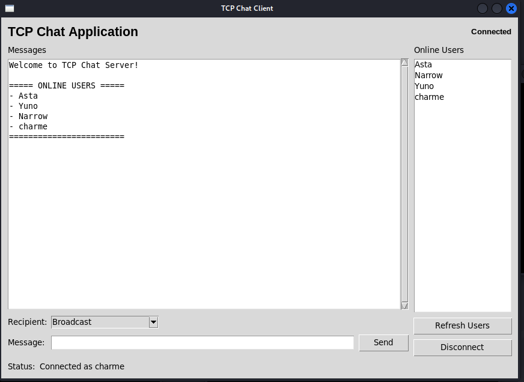
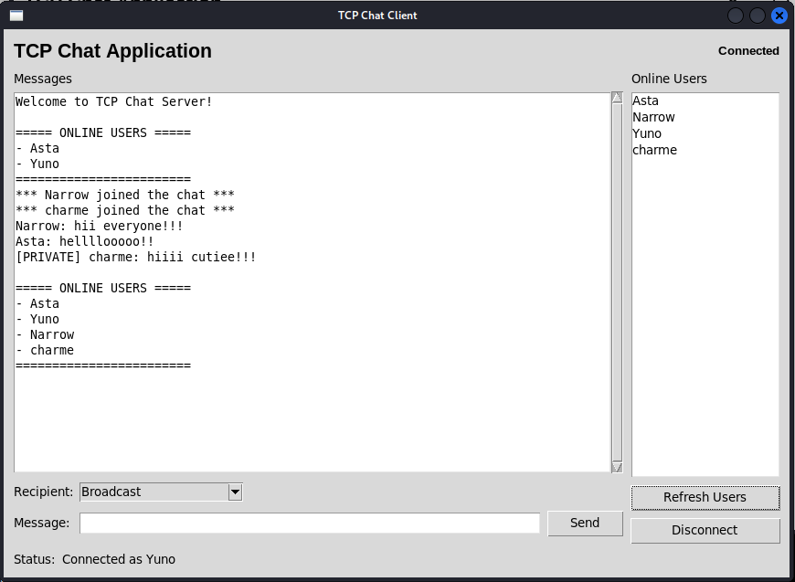
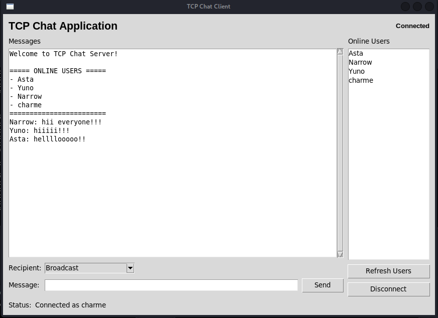
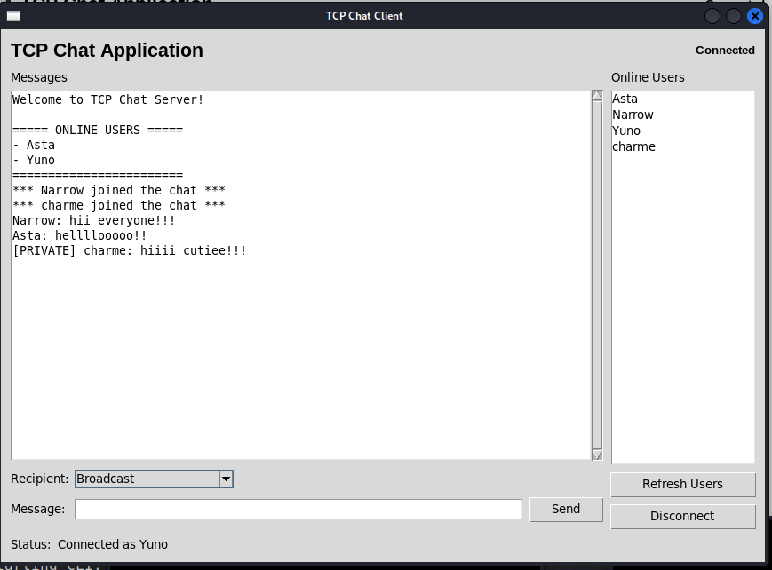
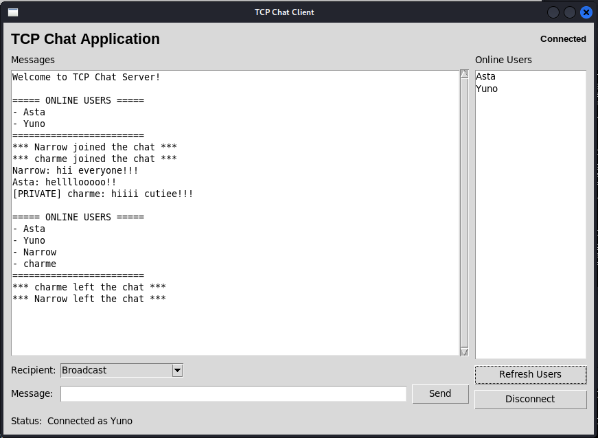
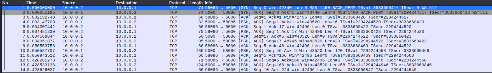
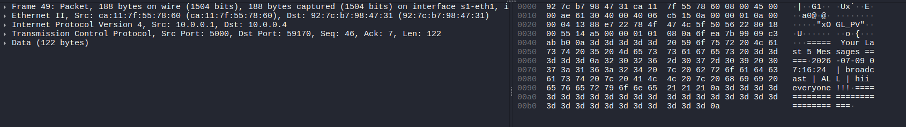
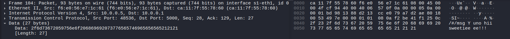
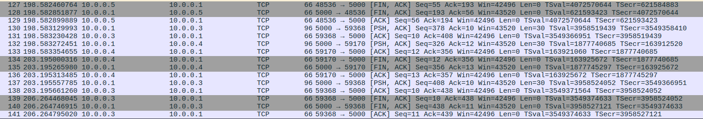

# Assignment 7 — Secure Network Application Development Using TCP

## Objective
Enhance the GUI-based multi-client TCP chat application from Assignment 6 by adding practical security features such as authentication, password hashing, duplicate login prevention, input validation, failed login blocking, session timeout, and secure logging.

## Features Implemented
- Username and password based authentication
- Password storage using SHA-256 hashes in `users.json`
- Duplicate login prevention for the same user
- Input validation for usernames, passwords, messages, and commands
- Temporary login blocking after 5 failed attempts
- Logout support
- Inactivity-based session timeout
- Secure logging without storing plaintext passwords
- Private messaging and broadcast messaging
- Online user list refresh

## Project Files
- `server.py` — TCP server with authentication and security controls
- `client_gui.py` — Tkinter-based client GUI
- `users.json` — stored user credentials as SHA-256 hashes
- `chat_history.csv` — message history log
- `security_log.txt` — security events log
- `screenshots/` — screenshots used for report and Wireshark verification
- `report.pdf` — final report
- `handwritten_reflection.pdf` — scanned handwritten answers

=======
## How to Run

### 1) Start Mininet
```bash
sudo /usr/local/bin/mn --topo single,5
```

Verify the topology:
```bash
nodes
net
pingall
```

<<<<<<< HEAD
## Execution Steps
1. Start Mininet:
   ```bash
   sudo /usr/local/bin/mn --topo single,5
   ```

2. Start the server on `h1`:
   ```bash
   h1 python3 server.py
   ```

3. Open separate terminals for clients:
   ```bash
   xterm h2
   xterm h3
   xterm h4
   xterm h5
   ```

4. Run the GUI client on each host:
   ```bash
   python3 client_gui.py
   ```

5. Use the server IP:
   ```text
   10.0.0.1
   ```

6. Login with a unique username for each client and test broadcast, private messaging, user list updates, and disconnect.

## Brief Description of the Implementation
This application is based on a client-server TCP architecture.

### Server Side
The server accepts multiple clients using threads and supports:
- username login
- broadcast messaging
- private messaging using `/msg <username> <message>`
- online user list using `/list`
- join and leave notifications
- chat history logging
- performance logging

### Client Side
The GUI client is implemented in Tkinter and includes:
- login window
- message display area with scrolling
- message input box
- recipient selection for broadcast or private message
- online users list
- connect and disconnect controls
- background thread for receiving messages so the GUI remains responsive

## Sample Screenshots
The following screenshots demonstrate the main features of the application.

### 1. Login Window


### 2. Chat Window After Successful Connection


### 3. Broadcast Messaging


### 4. Private Messaging


### 5. Client Disconnect


### 6. Wireshark Capture: Connection


### 7. Wireshark Capture: Broadcast


### 8. Wireshark Capture: Private Message


### 9. Wireshark Capture: Disconnect


## Features Tested
- User login
- Broadcast messaging
- Private messaging
- Online user list
- Join notification
- Leave notification
- Disconnect
- Multiple simultaneous clients

## Notes
- This project reuses the Assignment 5 networking logic.
- The GUI client keeps socket receiving operations in a separate background thread.
- The recommended Wireshark filter is:
  ```text
  tcp.port == 5000
  ```

## Repository Structure
```text
Assignment_6/
│── server.py
│── client_gui.py
│── Screenshots/
│   ├── Login.png
│   ├── Broadcast.png
│   ├── Private_Message.png
│   ├── Online_Users.png
│   ├── Disconnect.png
│   ├── Wireshark_Connection.png
│   ├── Wireshark_Broadcast.png
│   ├── Wireshark_PrivateMessage.png
│   └── Wireshark_Disconnect.png
│── report.pdf
└── README.md
=======
### 2) Start the server
```bash
python3 server.py
```

### 3) Start the client
```bash
python3 client_gui.py
```

### 4) Login
Use a valid username and password that exist in `users.json`.

## Security Demonstration / Testing

### Login validation
The client/server should reject:
- empty passwords
- passwords shorter than 6 characters
- invalid usernames
- unknown users

### Failed login protection
After 5 failed attempts, the account is blocked for 60 seconds.

### Duplicate login prevention
If the same username is already logged in, the second login attempt is rejected.

### Session management
If the user stays inactive for too long, the server closes the session and logs a timeout event.

### Secure logging
The server records events such as:
- `LOGIN SUCCESS`
- `LOGIN BLOCKED`
- `DUPLICATE LOGIN BLOCKED`
- `SESSION TIMEOUT`
- `DISCONNECTED`
- `LOGOUT`

## Wireshark Verification
Capture packets on the TCP port used by the application:
```bash
tcp.port == 5000
```

Use Wireshark to show:
- login attempt
- failed login
- authenticated communication after login
- logout / disconnect traffic

## Screenshots
The screenshots below show the security checks, successful login flow, duplicate login prevention, session timeout, and Wireshark verification.

### Summary Sheet


### Authentication and validation
| Wrong password | User not found | Password too short |
|---|---|---|
|  |  |  |

| Too many failed attempts | Successful login | Duplicate login blocked |
|---|---|---|
|  |  |  |

### Session and messaging
| Authenticated chat | Session timeout / disconnect | Server disconnect |
|---|---|---|
|  |  |  |

### Wireshark verification
| Failed login traffic | Authenticated traffic | Logout / timeout traffic |
|---|---|---|
|  |  |  |

## Sample Test Data
Preloaded users are stored in `users.json` and are saved as SHA-256 hashes.

## Notes
- This project reuses the Assignment 6 TCP chat application and extends it with security features.
- Never store or display plaintext passwords.

## Conclusion
This assignment demonstrates how a simple GUI-based TCP chat system can be improved with basic security controls such as authentication, password hashing, duplicate login prevention, session management, and secure logging.
